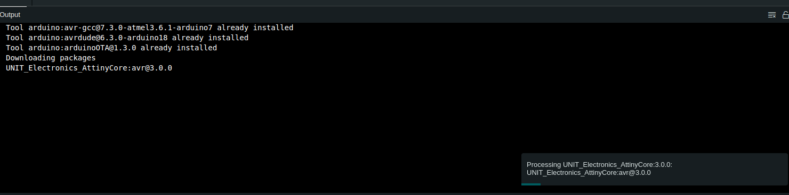
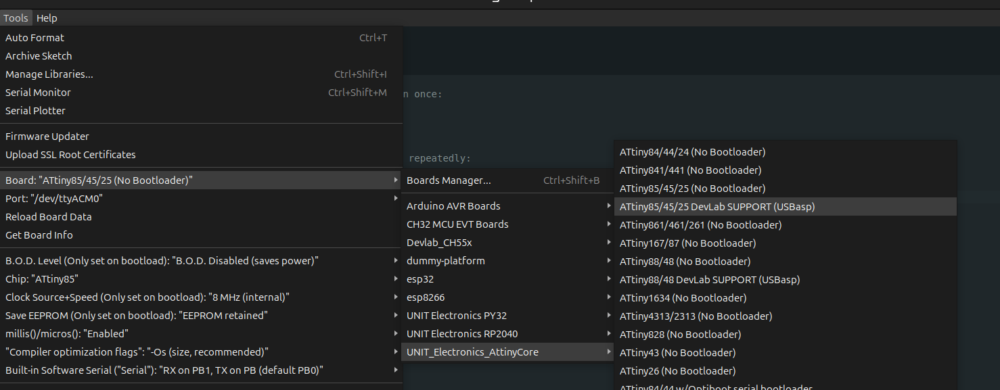
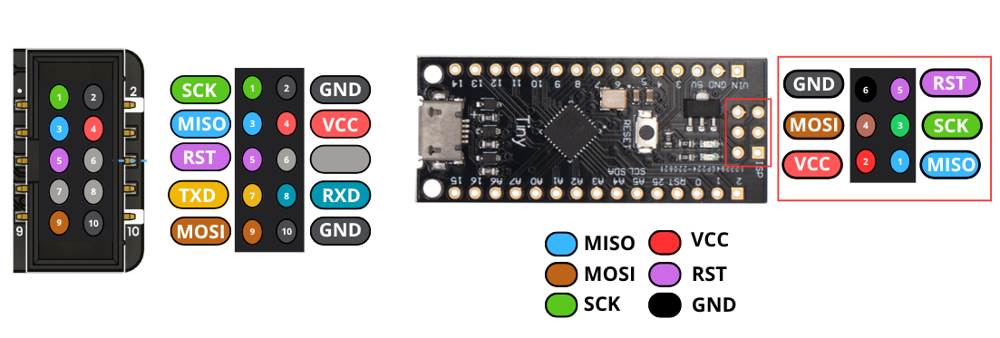
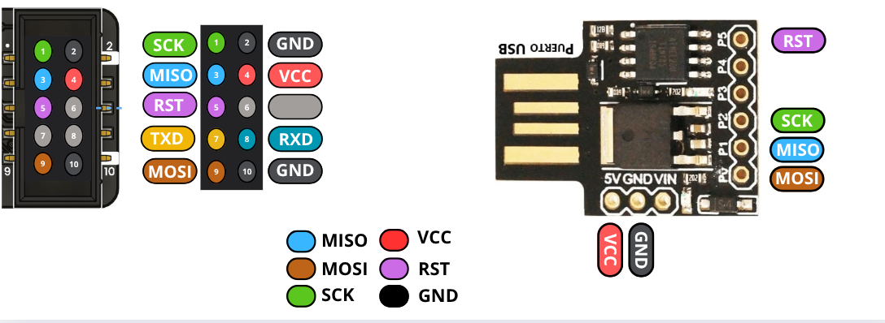
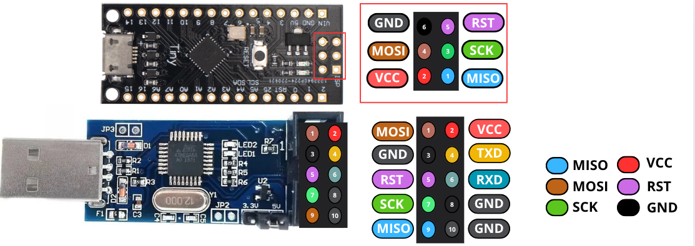

# UNIT Electronics AttinyCore - DevLab Support

This package provides support for programming ATtiny microcontrollers using the DevLab boards with USBasp programmer.

## Table of Contents

- [Installation](#installation)
- [Board Selection](#board-selection)
- [Hardware Connections](#hardware-connections)
- [Configuration](#configuration)
- [Upload Speed Settings](#upload-speed-settings)
- [Troubleshooting](#troubleshooting)
- [Examples](#examples)

---

## Installation

### Step 1: Add Board Manager URL

1. Open Arduino IDE
2. Go to **File > Preferences**
3. In "Additional Boards Manager URLs", add:
   ```
   https://raw.githubusercontent.com/UNIT-Electronics-MX/uelectronics_attinycore_arduino_package/main/package_uelectronics_attiny_custom.json
   ```
4. Click **OK**



### Step 2: Install the Package

1. Go to **Tools > Board > Boards Manager**
2. Search for **"UNIT Electronics AttinyCore"**
3. Click **Install**
4. Wait for the installation to complete


---

## Board Selection

After installation, select your DevLab board:

1. Go to **Tools > Board**
2. Select **UNIT_Electronics_AttinyCore**
3. Choose your board:
   - **ATtiny85/45/25 DevLab SUPPORT (USBasp)** - For ATtiny85/45/25
   - **ATtiny88/48 DevLab SUPPORT (USBasp)** - For ATtiny88/48



---

## Hardware Connections

### Supported Programmers

The DevLab boards are compatible with multiple ISP programmers:
- **CH552 USB Multi-Protocol Programmer** - UNIT Electronics custom programmer
- **USBasp** - Traditional AVR programmer

### Option 1: CH552 USB Multi-Protocol Programmer

The CH552 USB Multi-Protocol Programmer provides robust support for AVR microcontrollers via the In-System Programming (ISP) interface. This method enables direct programming of the target microcontroller's flash memory and EEPROM without removing it from the circuit.

#### Key Advantages:
- **Non-intrusive:** Program the MCU without desoldering or removing it from the board
- **Efficient workflow:** Ideal for development, testing, and field updates
- **Wide compatibility:** Supports common AVR chips used in educational and commercial projects

#### CH552 ISP Pin Connections

| Function | CH552 GPIO | Pin Characteristics | ATtiny Pin |
|----------|------------|---------------------|------------|
| MOSI     | 1.5        | MOSI, PWM1         | MOSI       |
| MISO     | 1.6        | MISO, RXD1         | MISO       |
| RESET    | 3.2        | PWM1, TXD0         | RESET      |
| SCK      | 1.7        | SCK, TXD1          | SCK        |
| VCC      | 3.3V/5V    | Power              | VCC        |
| GND      | GND        | Ground             | GND        |

**ATtiny88 with CH552 Multi-Protocol Programmer:**



**ATtiny85 with CH552 Multi-Protocol Programmer:**



#### CH552 Firmware Download

Download the AVR ISP firmware for the CH552 Multi-Protocol Programmer:

[Download firmware_avr_rst_p32.bin](https://github.com/UNIT-Electronics-MX/uelectronics_attinycore_arduino_package/releases/download/v3.0.0/firmware_avr_rst_p32.bin)

#### Firmware Flashing Support

For instructions on how to flash the firmware to the CH552 programmer, refer to:
- [WCHISPStudio Tutorial (Spanish)](https://wiki.uelectronics.com/tutoriales/wchispstudio)
- [Flash Firmware to CH552G using WCHISPStudio (English)](https://www.hackster.io/mrcronos/flash-firmware-to-cocket-nova-ch552g-using-wchispstudio-f91103)

#### Driver Compatibility

For complete driver installation instructions and IDE integration:
- [CH552 Multi-Protocol Programmer IDE Setup Guide](https://unit-electronics-mx.github.io/unit_devlab_ch552_multiprotocol_programmer_module/2_3_0_ide.html)

**Important Note:** The firmware supports alternative pin configurations. If you need to modify the ISP pin mapping, refer to the firmware source code:
- [AVR Programmer Firmware Source (with customizable pins)](https://github.com/UNIT-Electronics-MX/unit_ch55x_docker_sdk/tree/main/examples/usb/prog/avr)

#### Technical Overview - PicoAVR Programmer Architecture

The CH552 Multi-Protocol Programmer builds upon the PicoAVR Programmer project, which extends the foundational firmware developed by Stefan Warner. It includes enhanced compatibility for automated workflows via the spkg (small package) tool.

**Supported Development Workflows:**

1. **Native Toolchain (Makefile-Based)**
   - Ideal for users familiar with command-line environments and the SDCC toolchain
   - Provides fine-grained control over compilation, linking, and flashing
   - Requires: SDCC (Small Device C Compiler), Python 3, pyusb

2. **Dockerized Toolchain**
   - Recommended for portable and consistent development environment
   - No manual toolchain setup required
   - Ensures dependency isolation and platform independence

**Flashing Firmware to CH55x:**

The device uses the CH55x USB bootloader for firmware updates via USB.

**Bootloader Mode Activation:**
1. Disconnect power and USB from the device
2. Hold the BOOT button
3. Connect the board to USB while holding BOOT
4. Release BOOT once powered - bootloader remains active for a few seconds

**USB Permission Setup (Linux):**
```bash
echo 'SUBSYSTEM=="usb", ATTR{idVendor}=="4348", ATTR{idProduct}=="55e0", MODE="666"' | sudo tee /etc/udev/rules.d/99-ch55x.rules
sudo udevadm control --reload
sudo udevadm trigger
```

**Native Toolchain Setup (Linux/Debian):**
```bash
sudo apt install build-essential sdcc python3 python3-pip
pip3 install pyusb
```

**Compiling and Flashing:**
```bash
make flash     # Compile and flash firmware using makefile
# OR
python3 tools/chprog.py picoavr.bin  # Flash precompiled binary
```

**Windows Driver Setup:**

The picoAVR includes Windows Compatible ID (WCID) descriptors for automatic driver recognition.

If manual driver installation is needed, use Zadig:
1. Select USBasp interface, install libusbK driver
2. Select SerialUPDI interface, install CDC (USB-Serial) driver

**Device Features:**

- Onboard voltage selector (3.3V or 5V programming)
- USB enumeration as:
  - USBasp interface (for AVR ISP programming)
  - Additional CDC COM port (for UPDI communication)
- Supports:
  - 6-pin ICSP connector
  - 3-pin Serial UPDI connector
- Compatible with any programming environment that supports USBasp or Serial UPDI interfaces

**Technical Resources:**

| Resource | Description |
|----------|-------------|
| [CH552 Datasheet](https://www.wch-ic.com/products/CH552.html) | MCU reference |
| [SDCC Compiler](http://sdcc.sourceforge.net/) | Required C compiler |
| [CH55x SDK for SDCC](https://github.com/Blinkinlabs/ch554_sdcc) | SDCC-compatible SDK |
| [USBasp by Fischl](https://www.fischl.de/usbasp/) | Firmware reference |
| [CH55xduino](https://github.com/DeqingSun/ch55xduino) | Arduino-compatible CH55x toolset |

**License:** This project is licensed under the Creative Commons Attribution-ShareAlike 3.0 Unported License.

#### Important Legal Notice

**Use at Your Own Risk**

Ensure that you comply with all applicable laws and regulations when using this firmware. Use is at your own risk. The user assumes all responsibility for any consequences, including potential legal implications. The author and distributor of this firmware are not liable for any damage, misuse, or legal issues arising from its use.

Proceed with caution and discretion.

### Option 2: Traditional USBasp Programmer

The USBasp is a widely available, low-cost AVR programmer that uses the USB interface.

#### USBasp ISP Pin Connections

| USBasp Pin | Function | ATtiny Pin |
|------------|----------|------------|
| MOSI       | Master Out Slave In | MOSI |
| MISO       | Master In Slave Out | MISO |
| SCK        | Serial Clock | SCK |
| RESET      | Reset | RESET |
| VCC        | Power (5V or 3.3V) | VCC |
| GND        | Ground | GND |

**ATtiny88 with USBasp Programmer:**



#### Connection Notes

**Important for Both Programmers:**
- Ensure the DevLab board is powered (either from programmer or external source)
- Do not connect both USB power and external power simultaneously
- Both programmers can provide power through the ISP header if configured
- Verify voltage compatibility (3.3V or 5V) before connecting
- Ensure all connections are secure to avoid programming errors
- Use the correct upload speed setting based on your chip's clock frequency

**USBasp Driver Installation:**
- Windows: Install Zadig drivers or official USBasp drivers
- Linux: Usually works out-of-box, may require udev rules
- macOS: Install libusb via Homebrew

**CH552 Driver Installation:**
- Windows: WinUSB driver via Zadig or WCH official drivers
- Linux: Usually works out-of-box
- macOS: No additional drivers required

---

## Configuration

### Required Settings

After selecting your board, configure the following:

#### 1. Chip Selection
**Tools > Chip**
- ATtiny85 (8KB Flash, 512B RAM)
- ATtiny45 (4KB Flash, 256B RAM)
- ATtiny25 (2KB Flash, 128B RAM)
- ATtiny88 (8KB Flash, 512B RAM)
- ATtiny48 (4KB Flash, 256B RAM)

#### 2. Clock Source
**Tools > Clock Source + Speed**

Choose based on your hardware configuration:
- **8 MHz (internal)** - Default, no external crystal needed
- **16 MHz (PLL)** - For ATtiny85/45/25 only
- **1 MHz (internal)** - Low power applications
- **External crystal options** - When external crystal is connected

**Note:** Clock settings require burning the bootloader to set fuses.

#### 3. Upload Speed
**Tools > Upload Speed**

Select based on your chip's clock frequency:

**For ATtiny85/45/25:**
- **Slow (4kHz SCK)** - Safe for all clock speeds, including 1MHz
- **Medium (32kHz SCK)** - For 1MHz+ clocks
- **Fast (100kHz SCK)** - For 8MHz+ clocks
- **Very Fast (400kHz SCK)** - For 16MHz clocks

**For ATtiny88/48:**
- **Very Fast (400kHz SCK)** - Recommended for 8MHz+ clocks
- **Fast (100kHz SCK)** - For 8MHz clocks
- **Medium (32kHz SCK)** - For lower clock speeds
- **Slow (4kHz SCK)** - For 1MHz or slower clocks

#### 4. Additional Options

**B.O.D. (Brown-Out Detection):**
- Disabled - Saves power
- 1.8V, 2.7V, or 4.3V - Choose based on minimum operating voltage

**EEPROM Retention:**
- EEPROM retained - Preserves EEPROM data during chip erase
- EEPROM not retained - Erases EEPROM (default)

**millis()/micros():**
- Enabled - Default, provides timing functions
- Disabled - Saves flash memory

---

## Upload Speed Settings

The upload speed (SCK frequency) must be less than 1/4 of the target chip's clock frequency.

### Speed Selection Guide

| Chip Clock | Maximum Safe Upload Speed |
|------------|---------------------------|
| 128 kHz    | Slow (4kHz)              |
| 1 MHz      | Slow (4kHz)              |
| 8 MHz      | Fast (100kHz) or Very Fast (400kHz) |
| 16 MHz     | Very Fast (400kHz)       |

**Symptoms of incorrect upload speed:**
- Verification errors
- Upload failures
- "Device signature mismatch" errors

**Solution:** Select a slower upload speed if you encounter errors.

---

## Troubleshooting

### Upload Errors

**Error: "avrdude: error: could not find USB device"**
- Check USBasp is connected
- Verify USBasp drivers are installed
- Try a different USB port or cable

**Error: "Device signature mismatch"**
- Wrong chip selected in **Tools > Chip**
- Upload speed too fast for chip clock
- Poor connection between USBasp and board

**Error: "Verification error"**
- Upload speed too fast
- Reduce upload speed in **Tools > Upload Speed**
- Check power supply stability

### Burn Bootloader Issues

**Error during burn bootloader:**
- Ensure clock source matches hardware configuration
- For external crystal, verify crystal is installed and working
- Check all ISP connections

### Power Issues

**Board not detected or behaving erratically:**
- Verify power supply voltage (3.3V or 5V depending on configuration)
- Check for short circuits
- Ensure adequate current supply (minimum 50mA recommended)

---

## Examples

### Basic Blink Example

```cpp
// LED blink example for ATtiny85/88
// Connect LED to PB0 (ATtiny85) or PD0 (ATtiny88)

void setup() {
  pinMode(0, OUTPUT);  // Set pin 0 as output
}

void loop() {
  digitalWrite(0, HIGH);  // Turn LED on
  delay(1000);            // Wait 1 second
  digitalWrite(0, LOW);   // Turn LED off
  delay(1000);            // Wait 1 second
}
```

### Serial Communication Example (ATtiny85)

```cpp
// Software serial example for ATtiny85
// Uses built-in TinySoftwareSerial
// TX on PB0 (default), RX on PB1

void setup() {
  Serial.begin(9600);
  Serial.println("ATtiny85 DevLab Ready");
}

void loop() {
  Serial.println("Hello from DevLab!");
  delay(2000);
}
```

### ADC Reading Example

```cpp
// Read analog value from ADC
// ATtiny85: Use pins A1-A3 (PB2-PB4)
// ATtiny88: Use pins A0-A7

void setup() {
  pinMode(1, INPUT);  // Set pin as analog input
}

void loop() {
  int value = analogRead(1);  // Read analog value
  
  // Blink proportional to analog value
  digitalWrite(0, HIGH);
  delay(value);
  digitalWrite(0, LOW);
  delay(value);
}
```

### Low Power Sleep Example

```cpp
#include <avr/sleep.h>
#include <avr/power.h>

void setup() {
  pinMode(0, OUTPUT);
  
  // Flash LED to show we're alive
  for(int i = 0; i < 3; i++) {
    digitalWrite(0, HIGH);
    delay(100);
    digitalWrite(0, LOW);
    delay(100);
  }
}

void loop() {
  // Enter sleep mode
  set_sleep_mode(SLEEP_MODE_PWR_DOWN);
  sleep_enable();
  power_all_disable();
  sleep_mode();
  
  // Execution continues here after wake
  sleep_disable();
  power_all_enable();
  
  // Blink to show we woke up
  digitalWrite(0, HIGH);
  delay(50);
  digitalWrite(0, LOW);
  delay(950);
}
```

---

## Pin Mappings

### ATtiny85
| Arduino Pin | Physical Pin | Function |
|-------------|--------------|----------|
| 0           | PB0          | PWM, Serial TX |
| 1           | PB1          | PWM, Serial RX |
| 2           | PB2          | A1, INT0 |
| 3           | PB3          | A3 |
| 4           | PB4          | A2, PWM |
| 5           | PB5          | PWM, RESET |

### ATtiny88
| Arduino Pin | Physical Pin | Function |
|-------------|--------------|----------|
| 0-7         | PD0-PD7      | Digital, Serial |
| 8-13        | PB0-PB5      | Digital, SPI |
| 14-19       | PC0-PC5      | Digital |
| A0-A7       | PC0-PC5, ADC6, ADC7 | Analog Input |

---

## Resources

- [GitHub Repository](https://github.com/UNIT-Electronics-MX/uelectronics_attinycore_arduino_package)
- [UNIT Electronics Website](https://uelectronics.com)
- [ATtiny Datasheets](https://www.microchip.com)

---

## License

This package is based on ATTinyCore and is released under the LGPL v2.1 license. See LICENSE.md for details.

---

## Support

For issues, questions, or contributions:
- Open an issue on [GitHub](https://github.com/UNIT-Electronics-MX/uelectronics_attinycore_arduino_package/issues)
- Contact: UNIT Electronics

---

**Last Updated:** January 12, 2026  
**Version:** 3.0.0